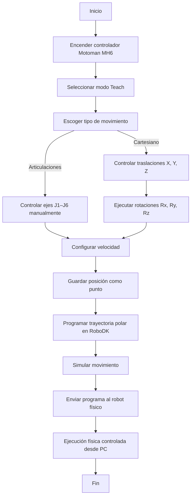

# 🧩 Informe Laboratorio No. 2 – Robótica Industrial
## Análisis y Operación del Manipulador Motoman MH6

### 📚 Universidad Nacional de Colombia
**Asignatura:** Robótica Industrial  
**Periodo:** 2025-II  
**Integrantes:**  
- Ariadna Contreras Nossa 
- David Santiago Nagles Barajas

---

## 1. Introducción
Breve descripción sobre la importancia de los manipuladores industriales, los objetivos del laboratorio y el contexto del Motoman MH6 y el ABB IRB140.

---

## 2. Comparación de manipuladores
| Característica | Motoman MH6 | ABB IRB140 |
|----------------|--------------|-------------|
| Carga máxima | | |
| Alcance | | |
| Grados de libertad | | |
| Velocidad máxima | | |
| Aplicaciones típicas | | |

**Análisis:**  
Explicación comparativa de las diferencias principales entre ambos manipuladores.

---

## 3. Configuraciones iniciales (Home1 y Home2)
Describir las posiciones articulares de cada configuración y justificar cuál resulta más conveniente para el trabajo en laboratorio.

---

## 4. Movimientos manuales del Motoman MH6
Explicar el procedimiento para realizar movimientos manuales, las teclas utilizadas para cambiar entre modos de operación y los tipos de movimiento posibles (articulaciones, cartesianos, traslaciones, rotaciones).

---

## 5. Control de velocidad
Detallar los niveles de velocidad disponibles, cómo realizar cambios entre ellos y cómo identificarlos en la pantalla del robot.

---

## 6. Aplicaciones del software RoboDK
Describir las principales funciones de RoboDK, cómo se comunica con el manipulador Motoman y qué operaciones permite realizar (programación, simulación, comunicación).

---

## 7. Comparación entre RoboDK y RobotStudio
Analizar ventajas, limitaciones y aplicaciones de cada software. Explicar cuál resulta más adecuado para distintos tipos de tareas.

---

## 8. Trayectoria polar
Describir el diseño, simulación y ejecución de una trayectoria polar en RoboDK, incluyendo:

- Capturas o referencias del entorno de simulación.
- Código empleado.
- Resultados observados en la simulación y en el robot físico.

### Diagrama de flujo (Mermaid)

---

## 9. Conclusiones
Reflexión general sobre los aprendizajes, retos y observaciones del laboratorio.

---

## 📘 Referencias
- Manual técnico del Motoman MH6 – Yaskawa Electric Corporation  
- Manual técnico ABB IRB140 – ABB Robotics  
- Documentación del Laboratorio de Robótica Industrial – UNAL 2025-II
