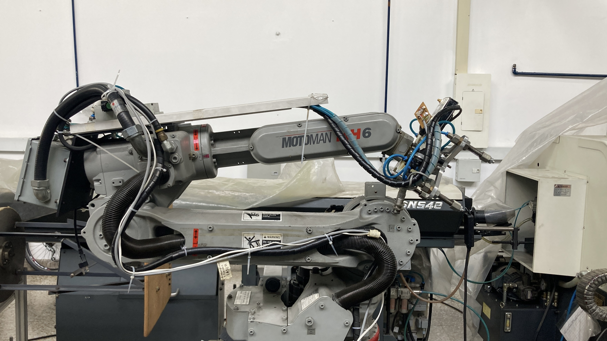
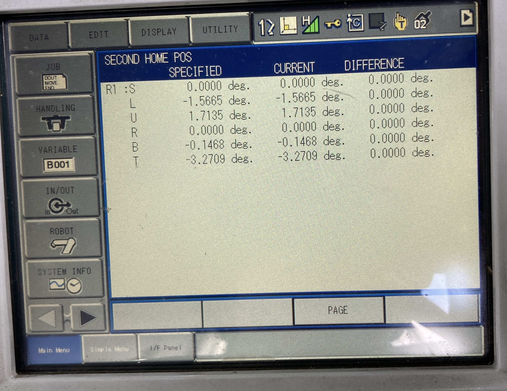
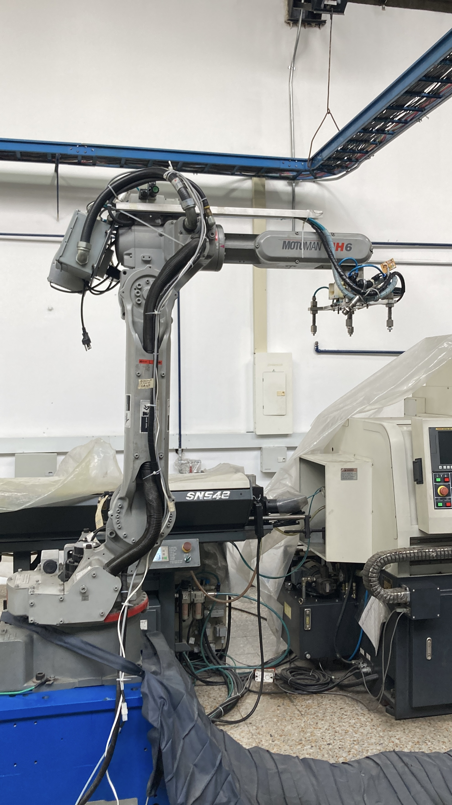

# 🧩 Informe Laboratorio No. 2 – Robótica Industrial
## Análisis y Operación del Manipulador Motoman MH6

### 📚 Universidad Nacional de Colombia
**Asignatura:** Robótica Industrial  
**Periodo:** 2025-II  
**Integrantes:**  
- Ariadna Contreras Nossa 
- David Santiago Nagles Barajas

---

## 1. Introducción

Este repositorio corresponde al desarrollo del **Laboratorio No. 2 de Robótica Industrial** del periodo **2025-II** en la **Universidad Nacional de Colombia**.  
El propósito principal es documentar, analizar y simular la **operación del manipulador Motoman MH6**, así como comparar sus características con el **ABB IRB140**, dos de los robots industriales más utilizados en entornos académicos y de automatización.

Los manipuladores industriales constituyen una herramienta esencial en la automatización moderna, permitiendo la ejecución precisa, repetitiva y eficiente de tareas de producción. Cada modelo posee características técnicas y configuraciones particulares que determinan su idoneidad para distintas aplicaciones, desde el ensamblaje y manipulación de materiales hasta procesos de soldadura y empaquetado.

Con ello, se busca integrar las competencias prácticas y teóricas de la asignatura, fomentando la comprensión de la programación, operación y análisis de robots industriales en un entorno académico-profesional.

[gif](Fotos/GIF LAB2.1)

🎥 [Ver simulación en YouTube](https://youtu.be/cUpMpt-YG90)


---

## 2. 🧾 Cuadro comparativo – Motoman MH6 vs ABB IRB140

| **Característica** | **Motoman MH6** | **ABB IRB140** |
|----------------------|------------------|-----------------|
| **Carga máxima** | 6 kg | 6 kg |
| **Alcance máximo** | 1.422 m | 0.81 m |
| **Número de grados de libertad (DOF)** | 8 | 6 |
| **Repetibilidad** | ±0.08 mm | ±0.03 mm |
| **Velocidad máxima (Eje 1)** | 180°/s | 200°/s |
| **Velocidad general (otros ejes)** | Hasta 250°/s | Hasta 320°/s (según eje) |
| **Peso del manipulador** | ≈ 130 kg | 98 kg |
| **Protección (IP)** | IP67 opcional | IP67 en base y muñeca |
| **Controlador** | DX100 | IRC5 |
| **Software de programación** | MotoSim EG / RoboDK | RobotStudio / RoboDK |
| **Montaje posible** | Piso, pared o techo | Piso, pared, techo o ángulo |
| **Aplicaciones típicas** | Ensamble, manipulación de materiales, alimentación de máquinas | Soldadura, encolado (*gluing*), empaquetado, fundición |
| **Ventajas principales** | Mayor alcance, fácil integración, bajo mantenimiento | Mayor precisión, rigidez estructural, mejor control de trayectoria |

---

## 3. Configuraciones iniciales (Home1 y Home2)

El manipulador **Motoman MH6** cuenta con dos configuraciones de referencia principales: **Home1** y **Home2**, las cuales permiten establecer posiciones base para la calibración, el arranque y la operación segura del robot. 
Estas configuraciones facilitan el reconocimiento del espacio de trabajo y previenen colisiones durante la ejecución de trayectorias programadas.

### 🔹 Home1
Corresponde a la **posición de referencia inicial o de calibración**.  
En esta configuración, las articulaciones se ubican con ángulos cercanos a **cero grados**, lo que coloca al manipulador en una postura compacta y simétrica respecto a su base.  
Esta posición se utiliza principalmente para:
- Calibrar el sistema y verificar el correcto funcionamiento de los encoders.  
- Realizar procedimientos de mantenimiento o verificación de límites articulares.  
- Estandarizar la posición de partida antes de ejecutar programas automáticos.


    


---

### 🔹 Home2
Es la **posición de seguridad o de intercambio de herramienta**, en la cual las articulaciones se orientan de forma que el robot se extienda parcialmente hacia adelante, maximizando el **espacio libre entre los eslabones** y facilitando el acceso al efector final.  
Esta configuración se utiliza para:
- Realizar **cambios de herramienta o piezas** de manera segura.  
- Ubicar el robot en una postura alejada de la base para **evitar colisiones** con la mesa o periféricos.  
- Establecer una posición segura intermedia antes de ejecutar trayectorias automáticas.


    


---

### ⚖️ ¿Cuál configuración es mejor?

La elección entre **Home1** y **Home2** depende directamente del contexto de uso:

- **Home1** es la más adecuada para **calibración, verificación de encoders y mantenimiento preventivo**, ya que garantiza una posición estándar y simétrica desde la cual se pueden referenciar todas las trayectorias.  
- **Home2**, en cambio, resulta más práctica para **operaciones automáticas y tareas de cambio de herramienta**, al proporcionar una postura extendida y con menor riesgo de colisión.

En la práctica de laboratorio, se recomienda **iniciar en Home1** para asegurar la correcta inicialización del robot y luego **mover hacia Home2** antes de comenzar la ejecución de trayectorias programadas o simuladas en RoboDK.

---

## 4. Movimientos manuales del Motoman MH6

El **Teach Pendant DX100** del manipulador **Motoman MH6** permite controlar manualmente el robot en diferentes modos de operación.  
Esta funcionalidad es fundamental para la **verificación de trayectorias**, **ajuste de posiciones de trabajo** y **calibración de herramientas** antes de ejecutar programas automáticos.

### 🔹 Modos de operación manual

Existen dos modos principales de movimiento:

#### 🦾 Modo Articulado (Joint)
En este modo, cada articulación del robot se mueve de forma independiente, lo que permite realizar ajustes finos o posicionamientos específicos por eje.  
El control se efectúa mediante las teclas dedicadas del Teach Pendant:

| **Articulación** | **Eje controlado** | **Teclas en el Teach Pendant** | **Movimiento** |
|------------------|--------------------|-------------------------------|----------------|
| J1 | Base (rotación principal) | **S+ / S-** | Giro a derecha / izquierda |
| J2 | Hombro | **L+ / L-** | Movimiento arriba / abajo |
| J3 | Codo | **U+ / U-** | Extensión / retracción |
| J4 | Muñeca rotacional | **R+ / R-** | Giro de la muñeca |
| J5 | Inclinación de muñeca | **B+ / B-** | Inclinación hacia adelante / atrás |
| J6 | Rotación final | **T+ / T-** | Rotación del efector final |

Al mantener presionada cada tecla **(+)** o **(–)**, la articulación correspondiente se desplaza en la dirección indicada.  
Este modo es especialmente útil para **movimientos de calibración** y para **verificar límites articulares** sin afectar las demás articulaciones.

---

#### 🌐 Modo Cartesiano (Base / Herramienta)
En el modo cartesiano, el movimiento del robot se define en términos de **traslaciones y rotaciones del efector final (Tool Center Point, TCP)** respecto a un sistema de coordenadas.  
Puede realizarse en el **sistema de la base (WORLD)** o en el **sistema de la herramienta (TOOL)**.

- **Traslaciones:** desplazamientos lineales del efector a lo largo de los ejes **X, Y, Z**.  
- **Rotaciones:** giros del efector alrededor de los ejes **Rx, Ry, Rz**.

| **Tipo de movimiento** | **Ejes involucrados** | **Acción resultante** |
|--------------------------|------------------------|------------------------|
| Traslación lineal | X, Y, Z | Desplaza el TCP a lo largo del espacio cartesiano |
| Rotación | Rx, Ry, Rz | Rota el TCP en torno a los ejes principales |

---

### 🔄 Cambio entre modos de operación

El cambio entre los modos **Articulado (Joint)** y **Cartesiano (Base o Tool)** se realiza desde el **selector de modo** del Teach Pendant o mediante el menú de configuración del controlador **DX100**.

Pasos generales:
1. Activar el **modo Teach** en el panel principal.  
2. Seleccionar el **modo de movimiento** deseado (`Joint` o `Cartesian`).  
3. Confirmar el sistema de referencia (WORLD o TOOL).  
4. Utilizar las teclas de movimiento correspondientes (S, L, U, R, B, T) o los controles en pantalla.  
5. Mantener pulsada la tecla **ENABLE** para habilitar el movimiento.  

---

## 5. Control de velocidad

El controlador **DX100** del manipulador **Motoman MH6** permite ajustar la velocidad de desplazamiento durante la operación manual, proporcionando al operador un control seguro y preciso sobre el movimiento de los ejes.  
Este ajuste resulta esencial al realizar **movimientos de calibración, pruebas de trayectorias o acercamientos al área de trabajo**, donde es necesario balancear precisión y rapidez.

### 🔹 Niveles de velocidad disponibles

El sistema cuenta con tres niveles predefinidos de velocidad manual, los cuales determinan la rapidez con que los motores responden al accionar las teclas del **Teach Pendant**:

| **Nivel** | **Descripción** | **Rango típico de velocidad** | **Uso recomendado** |
|------------|----------------|-------------------------------|----------------------|
| **Low (Bajo)** | Movimiento muy lento y controlado | 1 – 5 % | Calibraciones finas, alineación con sensores o herramientas |
| **Medium (Medio)** | Movimiento moderado, balance entre precisión y tiempo | 10 – 30 % | Ajustes generales y posicionamientos intermedios |
| **High (Alto)** | Movimiento rápido del manipulador | 50 – 100 % | Desplazamientos largos o retorno a posiciones seguras |

---

### 🔄 Cambio de nivel de velocidad

El cambio entre niveles se realiza mediante las **teclas de velocidad** del Teach Pendant, etiquetadas como:

- **SLOW** → Disminuye el nivel de velocidad actual.  
- **FAST / HIGH SPEED** → Aumenta el nivel de velocidad.  

El procedimiento general es el siguiente:
1. Activar el **modo Teach**.  
2. Seleccionar el tipo de movimiento (Articulado o Cartesiano).  
3. Presionar la tecla **FAST** para aumentar la velocidad o **SLOW** para reducirla.  
4. Verificar el valor de porcentaje mostrado en la pantalla del controlador.  

El **cambio de velocidad es inmediato**, por lo que el operador puede ajustar dinámicamente la velocidad durante la manipulación sin detener el movimiento actual.

---

### 🖥️ Identificación en pantalla

El nivel de velocidad activo se muestra en la **interfaz del Teach Pendant**, ya sea como:
- Una **barra de progreso** que representa el porcentaje de velocidad actual, o  
- Un **valor numérico porcentual** (por ejemplo, *VEL = 25%*).  

Esto permite conocer visualmente la velocidad configurada antes de realizar cualquier desplazamiento.  
Durante tareas de precisión o trabajo en zonas con riesgo de colisión, se recomienda mantener velocidades bajas para garantizar seguridad y control total sobre los ejes.

---

## 6. Aplicaciones del software RoboDK

**RoboDK** es un software de **simulación y programación offline** ampliamente utilizado en robótica industrial.  
Permite planificar, programar y verificar trayectorias robóticas en un entorno virtual, antes de su ejecución real en el manipulador físico.  
Gracias a su compatibilidad con una amplia gama de fabricantes (entre ellos **Yaskawa**, **ABB**, **Fanuc** y **KUKA**), es una herramienta esencial para la integración de sistemas robóticos industriales y educativos.

---

### 🔹 Principales funcionalidades de RoboDK

| **Funcionalidad** | **Descripción** |
|--------------------|------------------|
| **Programación Offline** | Permite crear y probar trayectorias sin interrumpir la operación del robot real. Admite la importación de modelos CAD (formatos STEP, IGES, STL) y la definición de puntos, trayectorias y programas completos. |
| **Simulación 3D** | Proporciona una visualización tridimensional del robot, el entorno y las trayectorias. Permite **detectar colisiones**, validar **alcances** y comprobar los límites articulares antes de la ejecución real. |
| **Post-procesadores** | Genera código adaptado al controlador de cada fabricante (por ejemplo, Yaskawa, ABB, Fanuc, KUKA). Cada post-procesador traduce las instrucciones genéricas de RoboDK a un formato compatible con el robot específico. |
| **Calibración y escaneo** | Permite calibrar el **TCP (Tool Center Point)**, marcos de trabajo (WObj) y herramientas externas utilizando protocolos estándar. También puede integrarse con sensores o escáneres 3D. |
| **API y automatización** | Dispone de una API accesible mediante **Python**, **C++**, **MATLAB** y otros lenguajes, lo que facilita la automatización de rutinas, creación de bucles y conexión con PLCs, bases de datos o sistemas de visión. |
| **Integración CAM/CAD** | Puede convertir trayectorias de mecanizado, corte láser, pintura o deposición (CAM) en movimientos robóticos, integrando software CAD/CAM directamente al flujo de trabajo del robot. |

---

### 🔹 Aplicaciones en el laboratorio

En el contexto del **Motoman MH6**, **RoboDK** se utiliza para:

- **Diseñar trayectorias personalizadas**, como la trayectoria polar solicitada en este laboratorio.  
- **Simular los movimientos** del robot verificando colisiones y alcances.  
- **Generar el código post-procesado** compatible con el controlador **YRC1000 / DX100**.  
- **Enviar el programa al robot físico** para su ejecución directa desde el computador.  

---

### 🔹 Comunicación con el manipulador Motoman MH6

RoboDK se comunica con el manipulador **a través del controlador Yaskawa (DX100 o YRC1000)**, utilizando un **protocolo Ethernet/IP** o una conexión directa mediante el **post-procesador Yaskawa Motoman**.  
El flujo de comunicación general es el siguiente:

1. El usuario **crea o simula una trayectoria** en el entorno de RoboDK.  
2. El software **post-procesa** el programa, generando un archivo con extensión compatible con el controlador del Motoman (por ejemplo, `.JBI`).  
3. Este archivo se **envía al controlador** mediante conexión de red o transferencia USB.  
4. El controlador **interpreta las instrucciones** (movimientos, velocidades, tiempos de espera, etc.) y las ejecuta físicamente en el manipulador.  
---

## 7. Comparación entre RoboDK y RobotStudio

Tanto **RoboDK** como **RobotStudio** son herramientas potentes para la **simulación, programación y verificación de trayectorias robóticas**, aunque cada una está orientada a diferentes propósitos y fabricantes.  
Mientras que **RoboDK** se destaca por su compatibilidad universal y su flexibilidad en lenguajes de programación, **RobotStudio** ofrece un entorno altamente optimizado y exclusivo para robots **ABB**.

---

### 🔹 Cuadro comparativo – RoboDK vs RobotStudio

| **Aspecto** | **RoboDK** | **RobotStudio** |
|--------------|-------------|-----------------|
| **Fabricante** | RoboDK Inc. | ABB Robotics |
| **Compatibilidad de marcas** | Multimarca (250+ fabricantes: Yaskawa, ABB, KUKA, Fanuc, UR, etc.) | Exclusivo para robots ABB |
| **Entorno de desarrollo** | Multiplataforma (Windows, Mac, Linux) | Windows exclusivamente |
| **Lenguajes de programación** | Python, C++, MATLAB, LabVIEW, API propia | RAPID (lenguaje nativo ABB) |
| **Simulación física** | Avanzada, con motores de colisión y cinemática universal | Altamente precisa para modelos ABB |
| **Comunicación con robots reales** | Sí (vía controladores Ethernet/IP o drivers específicos) | Sí (conexión directa vía RobotStudio y controlador IRC5) |
| **Capacidades CAD/CAM** | Importación universal (STEP, IGES, STL) e integración con software CAM | Integración nativa con PowerPacs y herramientas CAD de ABB |
| **Costo de licenciamiento** | Licencia por usuario o funcionalidad | Incluido con robots ABB |
| **Curva de aprendizaje** | Moderada, interfaz intuitiva | Alta, orientada a usuarios expertos en ABB |
| **Usos principales** | Educación, investigación, prototipado multi-robot, simulaciones generales | Programación y validación de celdas ABB industriales |

---

## 8. Trayectoria polar

### 🔹 Descripción general

En esta práctica se diseñó y ejecutó una **trayectoria polar** utilizando el software **RoboDK** y el manipulador **Motoman MH6**.  
El objetivo fue programar una figura tipo **“rosa polar”** mediante la ecuación paramétrica:

\[
r = A \cdot \cos(k\theta)
\]

donde:
- **r** es el radio en función del ángulo θ,  
- **A** representa la amplitud o radio máximo,  
- **k** determina el número de pétalos de la figura.  

El movimiento se simuló y posteriormente se ejecutó físicamente sobre el plano de trabajo definido en RoboDK.  
Durante la simulación, se verificaron posibles **colisiones, alcances articulares y velocidades**, garantizando una ejecución fluida antes de transferir el programa al robot físico.

---

### 🔹 Configuración en RoboDK

1. Se estableció la **conexión con RoboDK** a través de la API de Python.  
2. Se seleccionó el robot **Motoman MH6** y su **frame de referencia** (`Frame_from_Target1`).  
3. Se configuraron los parámetros de velocidad, blending y altura segura.  
4. Se definió el **Target Home2** como posición inicial.  
5. Se trazó la figura polar completa, seguida de la escritura de los nombres **ARIADNA** y **DAVID** como parte de la demostración práctica.

---

### 🔹 Código desarrollado en RoboDK (Python)

```python
from robodk.robolink import *    # API para comunicarte con RoboDK
from robodk.robomath import *    # Funciones matemáticas
import math

#------------------------------------------------
# 1) Conexión e inicialización
#------------------------------------------------
RDK = Robolink()
Target_Home2 = RDK.Item("Target Home2", ITEM_TYPE_TARGET)
robot = RDK.ItemUserPick("Selecciona un robot", ITEM_TYPE_ROBOT)
if not robot.Valid():
    raise Exception("No se ha seleccionado un robot válido.")

#------------------------------------------------
# 2) Selección de Frame y parámetros iniciales
#------------------------------------------------
frame_name = "Frame_from_Target1"
frame = RDK.Item(frame_name, ITEM_TYPE_FRAME)
if not frame.Valid():
    raise Exception(f'No se encontró el Frame "{frame_name}" en la estación.')

robot.setPoseFrame(frame)
robot.setPoseTool(robot.PoseTool())
robot.setSpeed(300)   # mm/s
robot.setRounding(5)  # blending

#------------------------------------------------
# 3) Parámetros de la rosa polar
#------------------------------------------------
num_points = 300
A = 150
k = 4
z_surface = 0
z_safe = 50

#------------------------------------------------
# 4) Movimiento inicial y dibujo de la figura
#------------------------------------------------
robot.MoveJ(Target_Home2)
robot.MoveJ(transl(0, 0, z_surface - z_safe))

full_turn = 2 * math.pi
for i in range(num_points + 1):
    t = i / num_points
    theta = full_turn * t
    r = A * math.cos(k * theta)
    x = r * math.cos(theta)
    y = r * math.sin(theta)
    robot.MoveL(transl(x, y, z_surface))

robot.MoveL(transl(x, y, z_surface - z_safe))
print(f"¡Figura (rosa polar) completada en el frame '{frame_name}'!")
```
El código completo, incluyendo la sección adicional que escribe los nombres ARIADNA y DAVID, se encuentra en el archivo  y el archivo de RoboDk en 

### Diagrama de flujo (Mermaid)
```mermaid
flowchart TD
    A[Inicio] --> B[Conexion a RoboDK]
    B --> C[Seleccion del robot Motoman MH6]
    C --> D[Configuracion del Frame y herramienta]
    D --> E[Definicion de parametros A, k, num_points y z_safe]
    E --> F[Movimiento inicial a Home2]
    F --> G[Inicio de dibujo de trayectoria polar]
    G --> H[Calcular r = A * cos(k*theta)]
    H --> I[Convertir coordenadas X, Y]
    I --> J[Ejecutar movimiento lineal MoveL]
    J -->|Repetir hasta completar 2*pi| G
    J --> K[Finalizar figura y subir eje Z]
    K --> L[Escribir nombres ARIADNA y DAVID]
    L --> M[Retornar a posicion segura Home2]
    M --> N[Fin de ejecucion]
```
---

## 9. Conclusiones
Reflexión general sobre los aprendizajes, retos y observaciones del laboratorio.

---

## 📘 Referencias
- Manual técnico del Motoman MH6 – Yaskawa Electric Corporation  
- Manual técnico ABB IRB140 – ABB Robotics  
- Documentación del Laboratorio de Robótica Industrial – UNAL 2025-II
