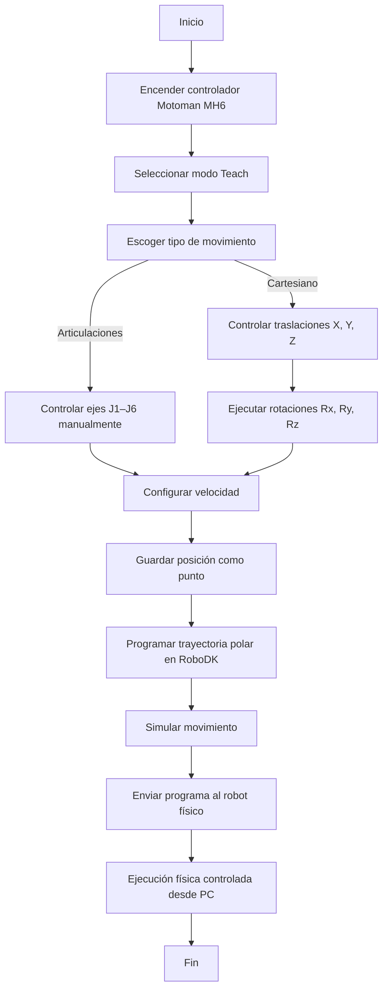

# 🧩 Informe Laboratorio No. 2 – Robótica Industrial
## Análisis y Operación del Manipulador Motoman MH6

### 📚 Universidad Nacional de Colombia
**Asignatura:** Robótica Industrial  
**Periodo:** 2025-II  
**Integrantes:**  
- Ariadna Contreras Nossa 
- David Santiago Nagles Barajas

---

## 1. Introducción

Este repositorio corresponde al desarrollo del **Laboratorio No. 2 de Robótica Industrial** del periodo **2025-II** en la **Universidad Nacional de Colombia**.  
El propósito principal es documentar, analizar y simular la **operación del manipulador Motoman MH6**, así como comparar sus características con el **ABB IRB140**, dos de los robots industriales más utilizados en entornos académicos y de automatización.

Los manipuladores industriales constituyen una herramienta esencial en la automatización moderna, permitiendo la ejecución precisa, repetitiva y eficiente de tareas de producción. Cada modelo posee características técnicas y configuraciones particulares que determinan su idoneidad para distintas aplicaciones, desde el ensamblaje y manipulación de materiales hasta procesos de soldadura y empaquetado.

Con ello, se busca integrar las competencias prácticas y teóricas de la asignatura, fomentando la comprensión de la programación, operación y análisis de robots industriales en un entorno académico-profesional.

---

## 2. 🧾 Cuadro comparativo – Motoman MH6 vs ABB IRB140

| **Característica** | **Motoman MH6** | **ABB IRB140** |
|----------------------|------------------|-----------------|
| **Carga máxima** | 6 kg | 6 kg |
| **Alcance máximo** | 1.371 m | 0.81 m |
| **Número de grados de libertad (DOF)** | 6 | 6 |
| **Repetibilidad** | ±0.08 mm | ±0.03 mm |
| **Velocidad máxima (Eje 1)** | 180°/s | 200°/s (IRB140) / 250°/s (IRB140T) |
| **Velocidad general (otros ejes)** | Hasta 250°/s | Hasta 320°/s (según eje) |
| **Peso del manipulador** | ≈ 80 kg | 98 kg |
| **Protección (IP)** | IP67 opcional | IP67 en base y muñeca |
| **Controlador** | YRC1000 / YRC1000micro | IRC5 |
| **Software de programación** | MotoSim EG / RoboDK | RobotStudio / RoboDK |
| **Montaje posible** | Piso, pared o techo | Piso, pared, techo o ángulo |
| **Aplicaciones típicas** | Ensamble, manipulación de materiales, alimentación de máquinas | Soldadura, encolado (*gluing*), empaquetado, fundición |
| **Ventajas principales** | Mayor alcance, peso liviano, fácil integración, bajo mantenimiento | Mayor precisión, rigidez estructural, mejor control de trayectoria |
| **Limitaciones** | Menor precisión que el ABB IRB140, velocidad más baja en algunos ejes | Menor alcance, peso más elevado |

---

## 3. Configuraciones iniciales (Home1 y Home2)

El manipulador **Motoman MH6** cuenta con dos configuraciones de referencia principales: **Home1** y **Home2**, las cuales permiten establecer posiciones base para la calibración, el arranque y la operación segura del robot. 
Estas configuraciones facilitan el reconocimiento del espacio de trabajo y previenen colisiones durante la ejecución de trayectorias programadas.

### 🔹 Home1
Corresponde a la **posición de referencia inicial o de calibración**.  
En esta configuración, las articulaciones se ubican con ángulos cercanos a **cero grados**, lo que coloca al manipulador en una postura compacta y simétrica respecto a su base.  
Esta posición se utiliza principalmente para:
- Calibrar el sistema y verificar el correcto funcionamiento de los encoders.  
- Realizar procedimientos de mantenimiento o verificación de límites articulares.  
- Estandarizar la posición de partida antes de ejecutar programas automáticos.

    

---

### 🔹 Home2
Es la **posición de seguridad o de intercambio de herramienta**, en la cual las articulaciones se orientan de forma que el robot se extienda parcialmente hacia adelante, maximizando el **espacio libre entre los eslabones** y facilitando el acceso al efector final.  
Esta configuración se utiliza para:
- Realizar **cambios de herramienta o piezas** de manera segura.  
- Ubicar el robot en una postura alejada de la base para **evitar colisiones** con la mesa o periféricos.  
- Establecer una posición segura intermedia antes de ejecutar trayectorias automáticas.

    

---

### ⚖️ ¿Cuál configuración es mejor?

La elección entre **Home1** y **Home2** depende directamente del contexto de uso:

- **Home1** es la más adecuada para **calibración, verificación de encoders y mantenimiento preventivo**, ya que garantiza una posición estándar y simétrica desde la cual se pueden referenciar todas las trayectorias.  
- **Home2**, en cambio, resulta más práctica para **operaciones automáticas y tareas de cambio de herramienta**, al proporcionar una postura extendida y con menor riesgo de colisión.

En la práctica de laboratorio, se recomienda **iniciar en Home1** para asegurar la correcta inicialización del robot y luego **mover hacia Home2** antes de comenzar la ejecución de trayectorias programadas o simuladas en RoboDK.

---

## 4. Movimientos manuales del Motoman MH6
Explicar el procedimiento para realizar movimientos manuales, las teclas utilizadas para cambiar entre modos de operación y los tipos de movimiento posibles (articulaciones, cartesianos, traslaciones, rotaciones).

---

## 5. Control de velocidad
Detallar los niveles de velocidad disponibles, cómo realizar cambios entre ellos y cómo identificarlos en la pantalla del robot.

---

## 6. Aplicaciones del software RoboDK
Describir las principales funciones de RoboDK, cómo se comunica con el manipulador Motoman y qué operaciones permite realizar (programación, simulación, comunicación).

---

## 7. Comparación entre RoboDK y RobotStudio
Analizar ventajas, limitaciones y aplicaciones de cada software. Explicar cuál resulta más adecuado para distintos tipos de tareas.

---

## 8. Trayectoria polar
Describir el diseño, simulación y ejecución de una trayectoria polar en RoboDK, incluyendo:

- Capturas o referencias del entorno de simulación.
- Código empleado.
- Resultados observados en la simulación y en el robot físico.

### Diagrama de flujo (Mermaid)

---

## 9. Conclusiones
Reflexión general sobre los aprendizajes, retos y observaciones del laboratorio.

---

## 📘 Referencias
- Manual técnico del Motoman MH6 – Yaskawa Electric Corporation  
- Manual técnico ABB IRB140 – ABB Robotics  
- Documentación del Laboratorio de Robótica Industrial – UNAL 2025-II
